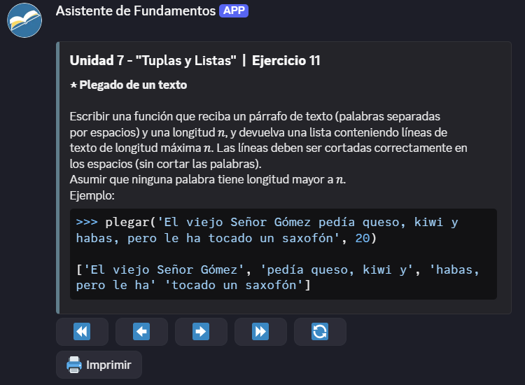

# Asistente de Fundamentos


<p align="left">


El Asistente de Fundamentos es una app de Discord con _bot user_ incluido para cumplir varias funciones misceláneas; entre ellas guardar y leer de la guía de ejercicios de la materia TB021 "Fundamentos de Programación" (curso Essaya) de la FIUBA.

Está pensado para usarse en el servidor de Discord de dicha materia, pero puede invitarse a cualquier servidor que lo quiera.
</p>

<hr style="width: 50%; height: 1" />

* [**Enlace de Invitación**](https://discord.com/api/oauth2/authorize?client_id=889312376036425810&permissions=294205467712&scope=bot%20applications.commands)

* **[Dependencias](requirements.txt)**

  | Nombre | Versión |
  | :-: | :-: |
  | [discord.py](https://pypi.org/project/discord.py/) | 2.5.2 |

* **[Changelog](./CHANGELOG.md)**

<hr style="width: 50%; height: 1" />

# Índice

* [Cómo Ejecutar](#cómo-ejecutar)

* [Comandos Comunes](#comandos-comunes)
  - [Ejercicios de la Guía](#ejercicios-de-la-guía)
  - [Manejo de Permisos](#manejo-de-permisos)
  - [_Otros..._](#otros-comandos)

* [Ejemplos de Uso](#ejemplos-de-uso)
  - [Uso de `/ej`](#uso-de-ej)

<hr/>

## Cómo Ejecutar

> [!NOTE]
> Esta versión del asistente se desarrolló con la versión de Python **`3.13.5`**, por lo que se recomienda esa versión.
>
> De igual forma, el cliente debería ser retrocompatible con versiones de Python anteriores. Está comprobado que funciona hasta con versiones de `3.11`. 

Uno debe pararse dentro de la carpeta [`run`](run), o de la carpeta raíz, y ejecutar uno de los dos
archivos presentes en [`run`](run), según el SO.

### **Ejemplos**
```bat
@REM para Windows
cd run
./run.bat
```
```sh
# para Linux u otro entorno de shell
cd run
./run.sh
```

> [!WARNING]
> En el directorio raíz debe existir un archivo `.env` que contenga una línea del tipo:
> ```
> DISCORD_TOKEN=<token>
> ```
> Donde `<token>` es el token dado por Discord cuando uno configura una app en la página.
>
> **El token del asistente en sí es privado,** por lo que si uno desea correr una instancia de esta lógica, ha de setear un bot aparte y correr esta lógica a ese nombre, o pedir el token al creador.

<hr/>

## Comandos Comunes

### Ejercicios de la Guía

Para configurar o visualizar la [guía de ejercicios](./doc/Guías%20de%20Ejercicios/PDF/2024C1.pdf) activa en el servidor.

* `/ej`: Permite ir a buscar el enunciado de un ejercicio específico de la guía de ejercicios.

* `/random`: Comando de conveniencia que devuelve un ejercicio aleatorio de cualquier unidad de la guía.
             Tiene opciones para configurar la búsqueda.

* `/guia`: Configura la versión de la guía en el servidor.

### Manejo de Permisos

El asistente cuenta con un sistema de permisos propio para comandos privilegiados.

* `/op <usuario|rol>`: Otorga nivel de permisos a otro miembro de un servidor, o un rol.

* `/deop <usuario|rol>`: Quita permisos de un miembro o rol de servidor.

* `/op list`: Permite ver todos los miembros/roles de un servidor que tienen permisos y con qué nivel.

### Otros Comandos

Comandos con efectos misceláneos.

* `/info`: Muestra información general sobre el asistente.

<hr/>

## Ejemplos de Uso

### Uso de `/ej`



#### Controles:

* `⏪`: Último ejercicio de la unidad anterior.

* `⬅️`: Ejercicio anterior de esta unidad.

* `➡️`: Ejercicio siguiente de esta unidad.

* `⏩`: Primer ejercicio de la unidad siguiente.

* `🔄`: Ejercicio aleatorio.

* `🖨️ Imprimir`: Manda el mensaje por el chat para que sea de vista pública.

<hr/>
